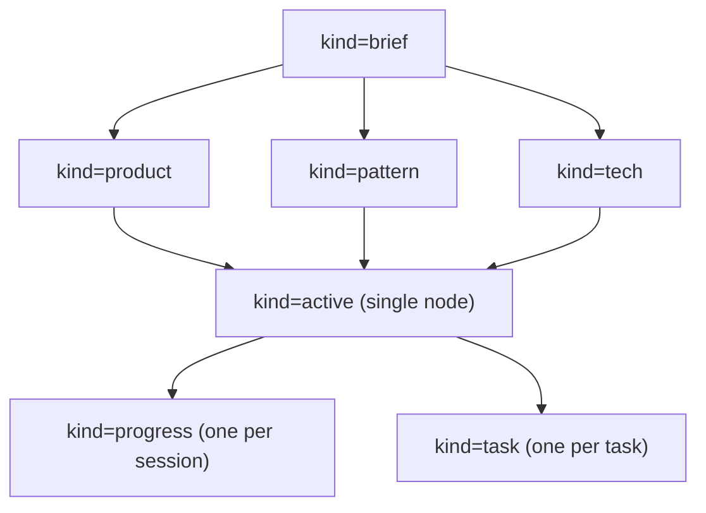
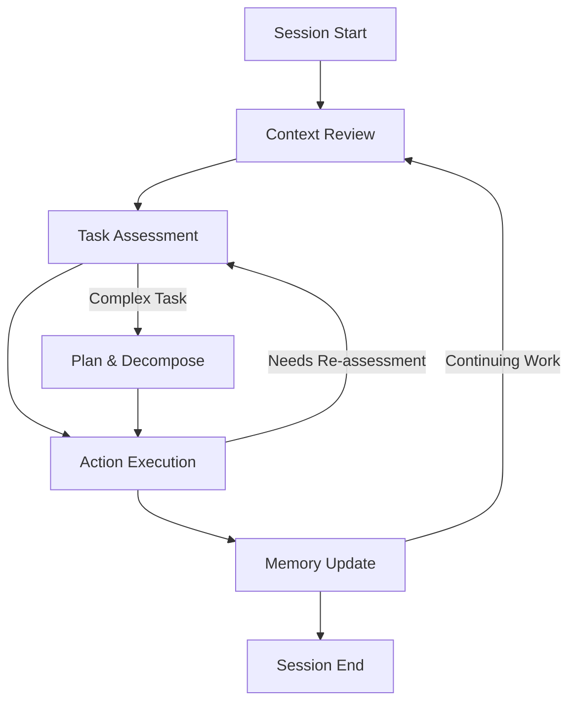
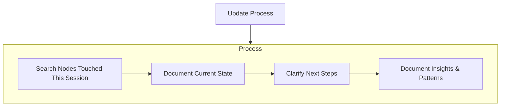

# Claude Code Memory Bank System

A system for maintaining project context across Claude Code sessions. This enables Claude Code to provide consistent development assistance throughout the project lifecycle.

**Backend**: Postgres (via the `memory-bank` MCP server in `server/`), not
Markdown files. The earlier file-based design (`memory-bank/*.md`) hit a
hard scaling wall: reading whole files at session start burned most of the
context budget, trimming content into archives made it hard to retrieve
later, and re-searching for lost material re-polluted context with noise.
The DB-backed design fixes this at the source — retrieval is vector +
graph search with **server-side filtering**, so a query returns only
relevant fragments, never a whole file's worth of unrelated material.

## Memory Bank Structure

The Memory Bank is a set of **nodes** (Postgres rows, one per atomic memory
unit) and **edges** (typed graph relations between them), reached only
through MCP tools — there are no files to open directly. Nodes build on
each other the same way the old files did, just as data instead of
documents:

### Node Kinds (Required)

1. **`kind="brief"`**
   - Foundation node(s) that shape everything else
   - Created at project start if none exist
   - Defines core requirements and goals
   - Source of truth for project scope

2. **`kind="product"`**
   - Why this project exists
   - Problems it solves
   - How it should work
   - User experience goals

3. **`kind="active"`** — exactly **one live node** per project
   - Current work focus
   - Recent changes
   - Next steps
   - Active decisions and considerations
   - Important patterns and preferences
   - Learnings and project insights
   - This is the *only* node `/start` reads directly — see "Lazy Loading
     Principle" below. It is updated in place (`memory_upsert(..., id=...)`),
     never duplicated.

4. **`kind="task"`** — one node per task (replaces the old `## Tasks` table
   rows). Fields map directly onto columns: `priority` (1-9), `importance`
   (1-5), `topic` (text[]), `depends_note` (short pointer), `status`
   (`active`/`inbox`/`archived`). `/start` reads these via `memory_tasks`,
   never by re-deriving them from `progress` nodes.

5. **`kind="pattern"`**
   - System architecture
   - Key technical decisions
   - Design patterns in use
   - Component relationships
   - Critical implementation paths

6. **`kind="tech"`**
   - Technologies used
   - Development setup
   - Technical constraints
   - Dependencies
   - Tool usage patterns

7. **`kind="progress"`** — one node per session (`title="Progress
   YYYY-MM-DD"`), not an ever-growing file. Never needs archiving (see
   "Lazy Loading Principle") because it's never read in bulk — only
   surfaced by search when actually relevant.

8. **`kind="devenv"`** — one node per discrete environment fact (a DB
   connection, a port table, an auth flow), not a monolithic reference file.
   Populated by `/scan-env`.

9. **`kind="decision"` / `kind="plan"`** — freeform, for anything that
   doesn't fit the above (an approved implementation plan, a one-off
   architectural decision record).

### Relationships (Edges)

Where the old system had no formal way to express "task A blocks task B"
except a free-text column, edges are first-class:
`depends_on` / `blocks` / `relates_to` / `supersedes` / `part_of` /
`refines` / `cross_ref`. Edges may connect nodes across different projects
— see "Cross-Project / Multi-Product" below.

### Additional Context

Use more `pattern`/`tech`/`decision` nodes (with descriptive `topic` tags)
to organize:
- Complex feature documentation
- Integration specifications
- API documentation
- Testing strategies
- Deployment procedures

There's no need to invent new file/folder structure for these — a new
topic tag and a `memory_link` edge to the relevant existing nodes does the
same job, and stays searchable rather than requiring someone to know a
folder exists.

## Core Workflow

Development sessions benefit from a systematic approach to Memory Bank usage:

### Core Steps Explained

1. **Context Review**: `/start` reads `memory_active` + `memory_tasks` only — no broad scan
2. **Task Assessment**: Analyze task complexity, risk, and required approach
3. **Plan & Decompose** (Complex Tasks): Break down complex tasks into manageable subtasks with clear implementation strategy
4. **Action Execution**: Implement solution using appropriate methodology
5. **Memory Update**: Document important changes and learnings for future sessions

## Documentation Updates

Memory Bank updates occur when:
1. Discovering new project patterns or architectural decisions
2. After implementing significant code changes or completing major features
3. When comprehensive review is needed to maintain accuracy
4. When context needs clarification for future sessions
5. At natural project milestones (e.g., completing authentication system, finishing API endpoints)

Note: `/workflow:update-memory` targets its review at nodes relevant to
*this session's* work via `memory_search`, not a blanket "review every
node" pass — that would reintroduce the same context-budget problem the DB
backend was built to solve. Focus particularly on the single `active` node
and any `task` nodes as they track current state.

## Operational Principles

- Start each session by loading `memory_active` + `memory_tasks` — nothing more
- Apply documented patterns and decisions consistently
- Document significant changes and decisions promptly
- Maintain Memory Bank accuracy as the foundation for effective assistance

## Lazy Loading Principle

As a project's Memory Bank grows, reading everything at session start burns most of the context budget before any work happens. The DB backend keeps `/start` cheap regardless of project size by construction:

- **`memory_active` + `memory_tasks` are the only calls `/start` makes.** The single `active` node must be self-sufficient for triage: project summary, current focus, blocker. Tasks come from `memory_tasks`, never reconstructed by scanning `progress` nodes.
- **Deep nodes load on demand, filtered, not in a block.** Once a task is chosen, `/workflow:understand` dispatches the **`memory-scan`** subagent (`.claude/agents/memory-scan.md`) rather than reading broadly. This is the second half of what makes this cheap — see "Scan-and-Report Pattern" below.
- **`progress` and `devenv` nodes are write-mostly, narrow-read.** They're never read in bulk — they surface only when `memory_search` finds them relevant to an actual query. There is nothing to archive: a node that hasn't been searched for in months costs nothing sitting in Postgres, unlike a markdown file that has to be skimmed in full to find anything in it.

## Scan-and-Report Pattern

The lazy-loading principle above solves *what* gets loaded. This solves what happens to material that gets loaded but turns out not to matter — the problem of context getting polluted by candidates that were checked and rejected.

Two mechanisms work together:

1. **Server-side filtering.** `memory_search` never returns raw candidates for a human or model to sift through — it applies a similarity threshold, expands the graph only from nodes that passed it, and drops anything previously `memory_mark`'d `irrelevant` for the same query. Rejected candidates are filtered in SQL, not handed back.
2. **Subagent isolation.** The `memory-scan` subagent is the only thing that calls `memory_search`/`memory_get` during task investigation. It reviews results in its own disposable context, calls `memory_mark` on anything it judges irrelevant (so future identical searches stop resurfacing it), and returns only a synthesized brief to the calling session. Everything it read — including material it decided not to use — is discarded when it finishes; only the brief survives into the main conversation.

This is why `/workflow:understand` delegates to `memory-scan` instead of calling the search tools itself: doing the filtering step in a subagent is what keeps "scanned but unneeded" content out of the session that actually needs to stay lean.

## Cross-Project / Multi-Product

One Postgres instance holds memory for multiple, often-related projects (e.g. a product's core, its landing page, a Kafka component, shared libraries) scoped by `project_id`. This is deliberate, not incidental — it's what makes cross-project workflows possible without a separate system:

- **Groups**: related projects share a `group_id` (`project_group_create`/`project_create`). `memory_search(scope="group")` searches the whole family; `scope="project"` (default) stays isolated to avoid accidental leakage between unrelated products.
- **Deliberate cross-writes**: filing a note or task into a *different* project than the current session's requires naming that project's slug explicitly (`memory_upsert(project="other-slug", ..., filed_from_project="this-slug")`) — it cannot happen by accident. Cross-project *tasks* land with `status="inbox"`.
- **Inbox surfacing**: `memory_tasks` returns `inbox` as a separate list from `tasks`, and `/start` renders it as its own block ("📥 Filed from other sessions") — nothing filed cross-project silently merges into the target project's own backlog.
- **Cross-project edges**: `cross_ref` edges tie a filed node back to the context that produced it, in the *originating* project, retrievable via `memory_get(hops=1)`.

## Remember
Each session starts completely fresh. The Memory Bank — now Postgres, reached only through the `memory-bank` MCP server — is the only persistent link to previous work. It must be maintained with precision and clarity, as effectiveness depends entirely on its accuracy.

--- End of Contents ---
